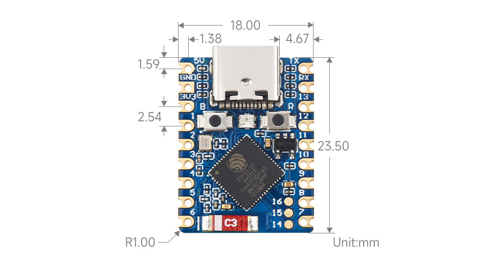
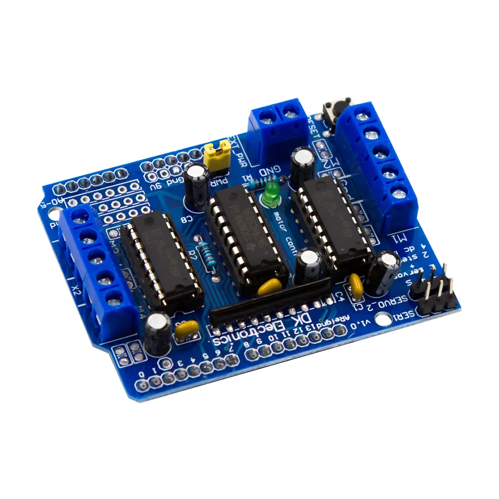

## WaveShare ESP32-S3 
- Example repository for utilizing the WaveShare ESP32-S3 Mini module with the L239D Motor Shield. This repository contains sample code and resources to controll DC motors using the provided shield with the ESP32-S3 Mini module.
- Note: This repository contains a modified version of the Adafruit Motor Shield Library tailored for use with the ESP32-S3 Mini module and the L239D Motor Shield for DC Motor Only.
- Tested with 1 Motor on M1 only.

### Connections

| L239D  | ESP32-S3     |
|--------|--------------|
| 11     | GPIO_NUM_11  |
| 3      | GPIO_NUM_3   |
| 6      | GPIO_NUM_6   |
| 5      | GPIO_NUM_5   |
| 12     | GPIO_NUM_12  |
| 4      | GPIO_NUM_4   |
| 7      | GPIO_NUM_7   |
| 8      | GPIO_NUM_8   |

### Modules/MicroContllers
- ESP32-S3 Mini WaveShare Module

- L239D Motor Shield

### Disclaimer;
- Users are encouraged to review and test the code thoroughly in their own environments before deploying it in production or critical systems.
- Users are responsible for any issues or damages that may occur as a result of using the provided code and resources. 
The owner of this repository provides these materials for educational and informational purposes only, and usage is at the user's own risk. 
